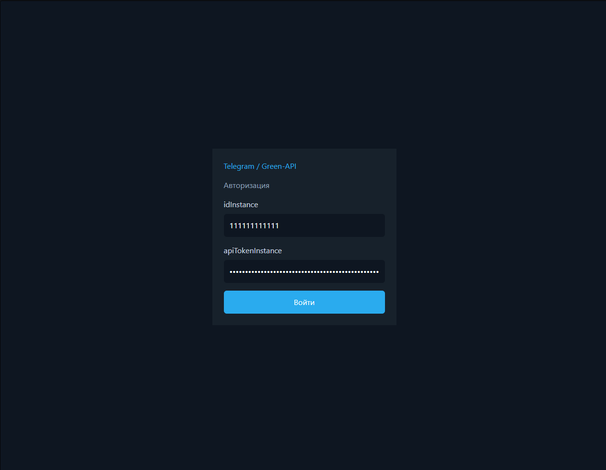
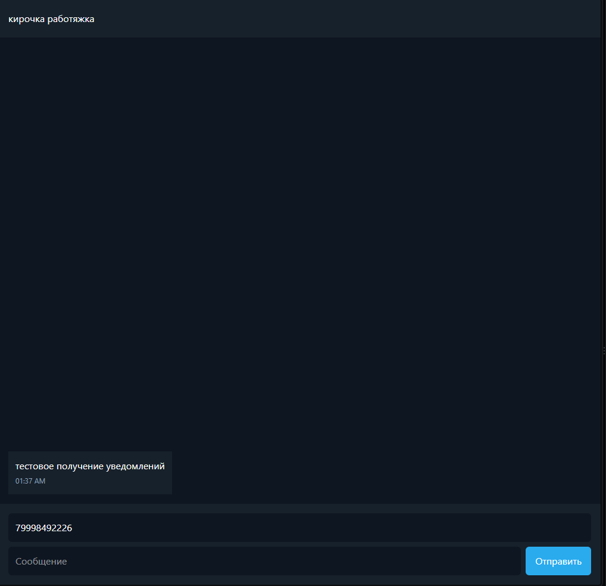
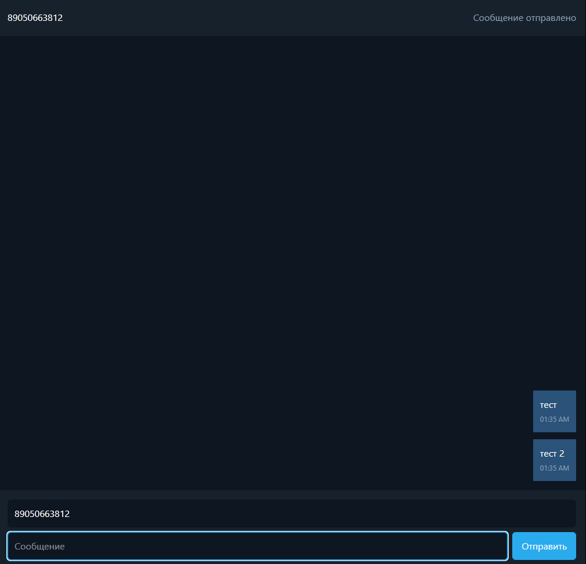

# Green-API Telegram Messenger

Небольшой React-интерфейс для отправки и получения текстовых сообщений через Telegram API Green-API.

## Возможности

- авторизация через `idInstance` и `apiTokenInstance`;
- получение списка личных чатов через `getChats`;
- выбор чата из списка;
- отправка текстовых сообщений через `sendMessage`;
- проверка входящих уведомлений каждые 5 секунд;

## Требования

- Node.js желательно `24.18.1`
- npm;
- Telegram-инстанс, созданный и авторизованный в Green-API Console.

## Запуск проекта

Установить зависимости:

```bash
npm install
```

Запустить dev-сервер:

```bash
npm run dev
```

**В dev-режиме компонент рендериться дважды, поэтому будет выбивать ошибку на получение чатов, но на функциональность это не влияет

Приложение будет доступно по адресу:

```text
http://localhost:5172/
```

## Подготовка Green-API

1. Открыть [Green-API Console](https://console.green-api.com/).
2. Создать Telegram-инстант или открыть существующий.
3. Авторизовать Telegram-аккаунт в этом инстансе.
4. Скопировать значения:
   - `idInstance`;
   - `apiTokenInstance`.
5. Включить получение уведомлений о входящих сообщениях и файлах.
6. Сохранить настройки.

## Проверка приложения

1. Открыть приложение в браузере по адресу http://localhost:5172/
2. Ввести `idInstance` и `apiTokenInstance` в соответсвующие поля
3. Нажать «Войти» (*если надо изменить `idInstance` и `apiTokenInstance` после входа - кнопка для релогина в самом низу списка чатов)
4. Убедиться, что справа загрузился список личных чатов (сделано для удобства ввода номера, но по прежнему позволяет ввести любой номер)
5. Выбрать нужный чат или вести номер самостоятельно
6. Убедиться, что в поле получателя используется номер телефона
7. Ввести сообщение и нажать «Отправить» или нажать клавишу Enter
8. Для проверки входящих сообщений отвечаем на подключенный Telegram с другого аккаунта
9. В течение 5 секунд ответ должен появиться в выбранном чате приложения

## Скриншоты

### Вход



### Получение сообщений



### Отправка сообщений


